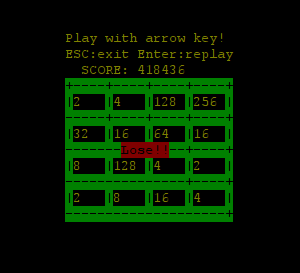

#2048-go

##about 2048-go
2048 is a famous game by Gabriele Cirulli, I copyed the idea and rewrite it with golang. 

This 2048 runs under terminial. It can run without X under linux. I don't know if it works under DOS, But it works under CMD. The code is cross platform for using golang. 

Thanks for termbox-go.

This is Gabriele Cirulli's code. 

> https://github.com/gabrielecirulli/2048

##Screenshot

My code works like this.

I have not got 2048 yet. If you get there, share me with your Screenshot.

##Get binnary.

The binnary is avilable on gobuild.io

[Down on gobuild.io](http://gobuild.io/download/github.com/wangwenbin/2048-go)

##License

2048 is licensed under the MIT license.
